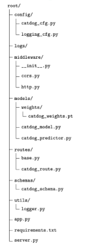

# deploy_modelAPI

config/: Folder containing(chua dung) configuration for some modules.

logs/: Folder containing logging information when running API.

middleware/: Folder containing code for middleware.

models/: Folder containing Deep Learning weights.

routes/: Folder containing API Endpoints declaration.

schemas/: Folder containing Pydantic model declaration.

utils/: Folder containing codes for general purpose (varying between projects).

app.py: Python file containing codes for FastAPI app initialization.

server.py: Python file containing codes to host the API service.